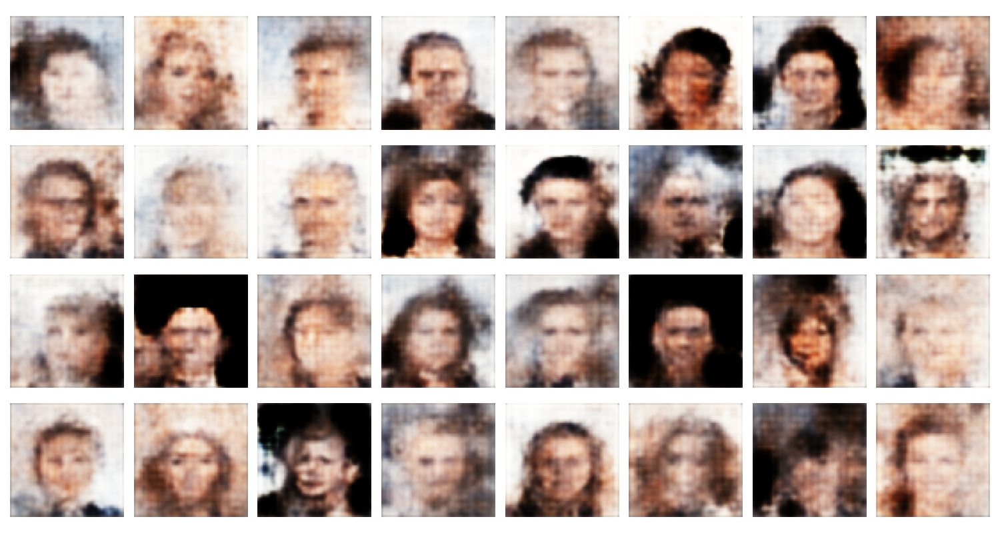
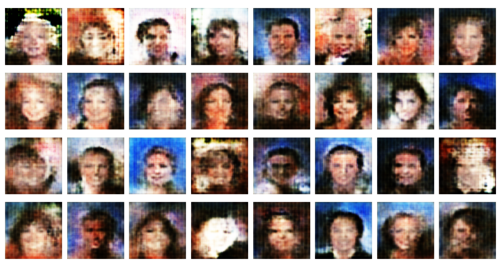
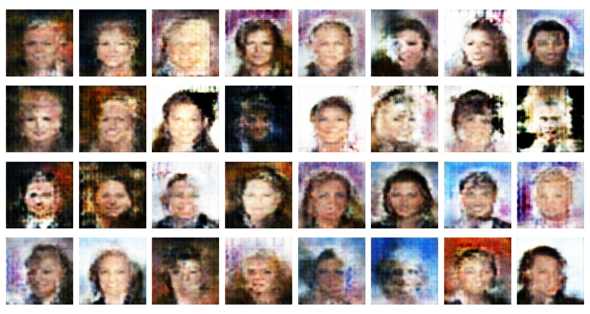
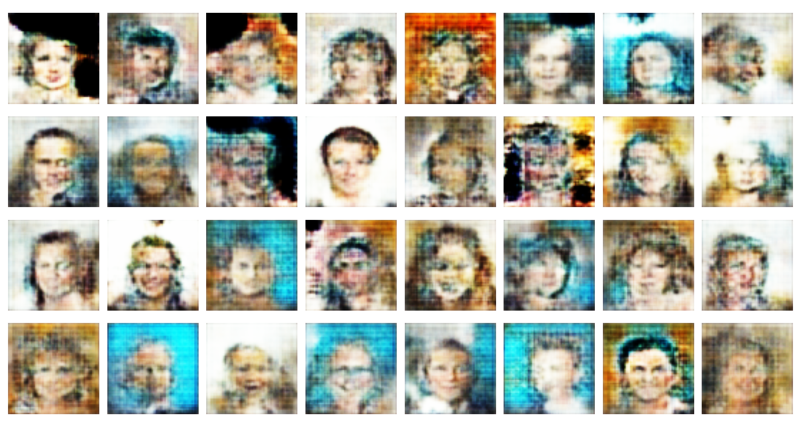
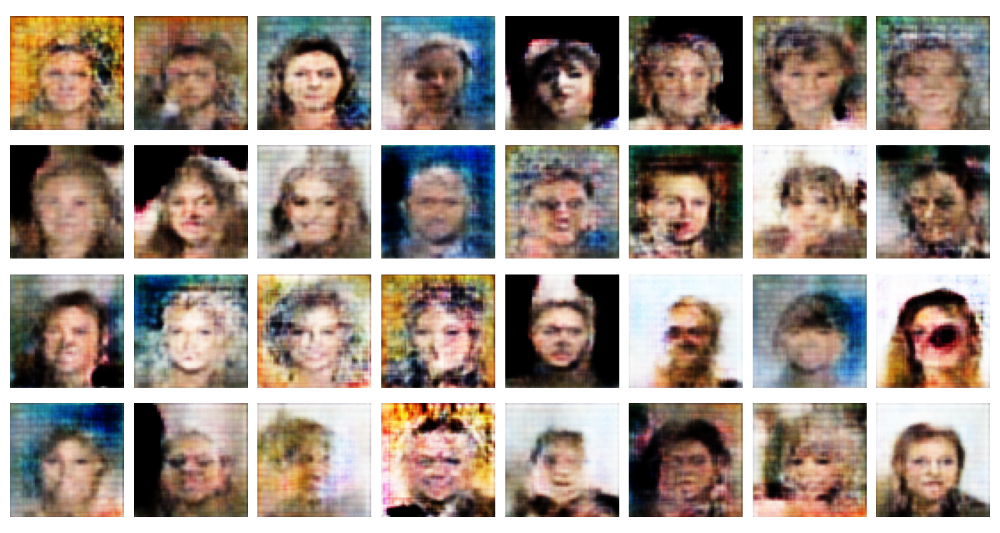

# Wasserstein GAN with Gradient Penalty (WGANGP)

This repository contains an implementation of Wasserstein GAN with Gradient Penalty (WGANGP) and Wasserstein GAN (WGAN) for generating high-quality images from the CELEBA dataset. The generator and discriminator are defined using PyTorch.

## Architecture Overview

### Discriminator:
The Discriminator consists of a series of convolutional layers, using LeakyReLU activations and Instance Normalization for stability. The network downsamples the image while learning to distinguish between real and generated (fake) images.

- Input: RGB image (3 channels)
- Output: Single scalar (real or fake decision)

The architecture has the following layers:

- Conv2d with 4x4 kernel, stride 2, and padding 1, followed by LeakyReLU
- Conv2d with 4x4 kernel, stride 2, and padding 1, followed by InstanceNorm2d and LeakyReLU
- Further similar blocks with increasing channels
- Final Conv2d output layer to produce the scalar decision

### Generator:
The Generator transforms a latent vector into a realistic image using a series of transposed convolutional layers. It upsamples the latent vector while Batch Normalization and ReLU ensure smooth training and image generation.

- Input: Latent vector (typically sampled from a Gaussian distribution)
- Output: RGB image (3 channels)

The architecture has the following layers:

- ConvTranspose2d with 4x4 kernel, stride 1, and padding 0, followed by BatchNorm2d and ReLU
- ConvTranspose2d layers with stride 2 to upsample the image
- Final ConvTranspose2d output layer with Tanh activation to generate RGB images

### Weight Initialization:
Weights are initialized to a normal distribution with mean 0.0 and standard deviation 0.02 using the `initialize_weights` function.

### How to Run:
1. Clone the repository:
   ```bash
   git clone https://github.com/Ganesh2609/WGANGP.git
   cd WGANGP
   ```

## Results

Below are the results after training the WGANGP model for 5 epochs. The generated images are saved in the `Results` folder.

### Epoch 1


### Epoch 2


### Epoch 3


### Epoch 4


### Epoch 5
