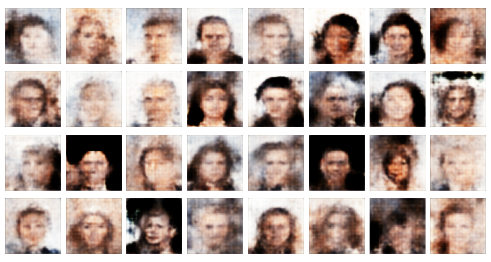
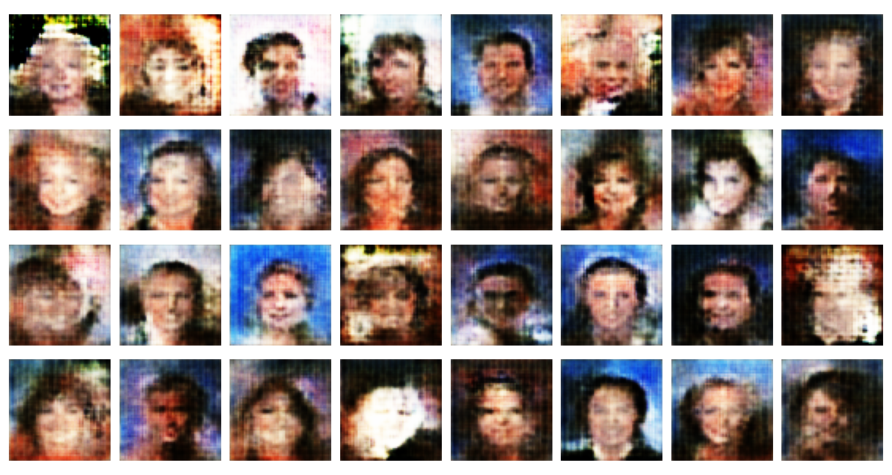
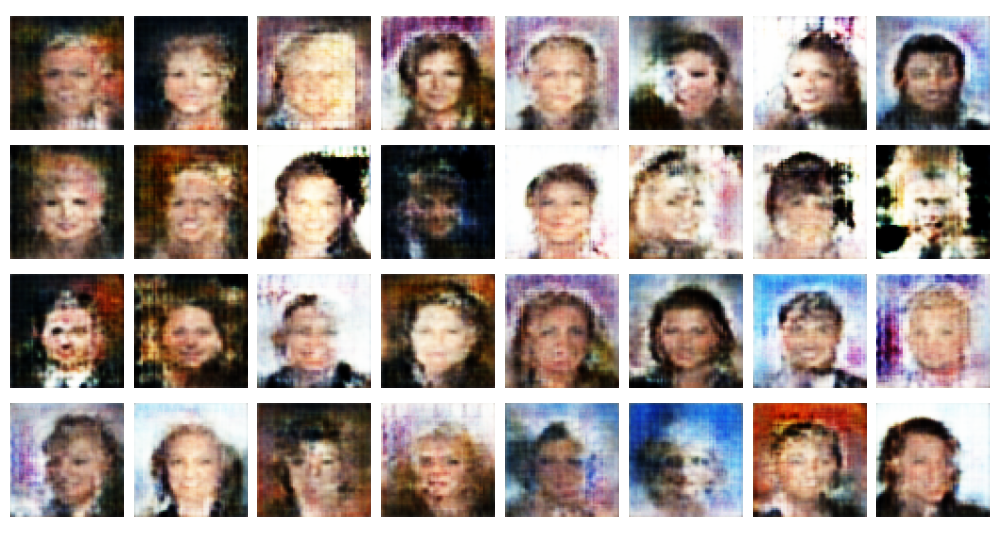
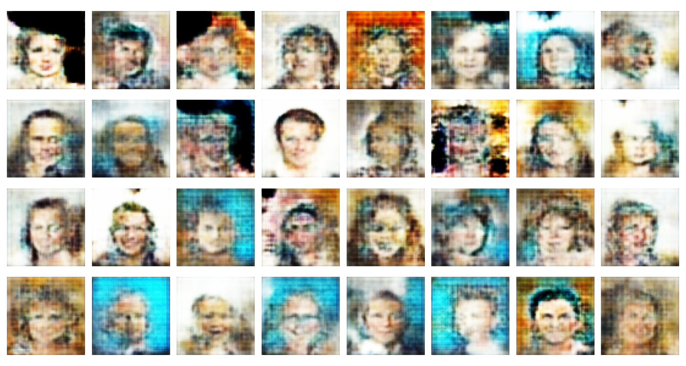
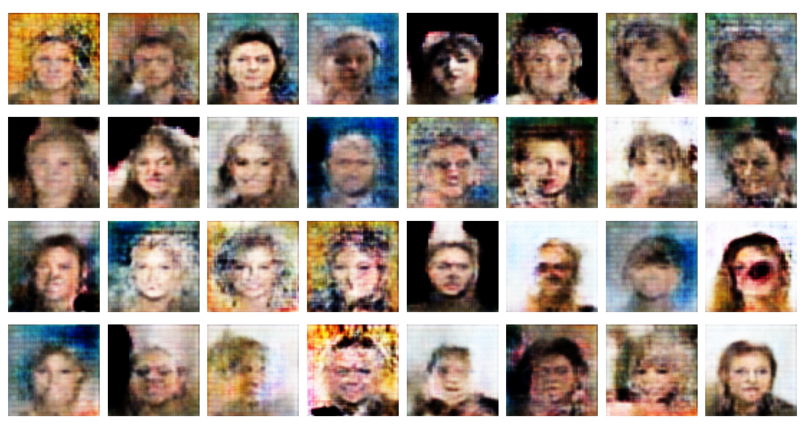

# Wasserstein GAN with Gradient Penalty (WGANGP)

A PyTorch implementation of Wasserstein GAN with Gradient Penalty for generating high-quality facial images using the CelebA dataset. This project includes both WGAN-GP and standard WGAN implementations with comprehensive training utilities.

## Theory

**Wasserstein GAN (WGAN)** addresses the training instability issues of traditional GANs by using the Wasserstein distance (Earth Mover's distance) as the loss function instead of the Jensen-Shannon divergence. This provides more meaningful loss curves and improved training stability.

**WGAN with Gradient Penalty (WGAN-GP)** further improves upon WGAN by replacing weight clipping with a gradient penalty term. This ensures the discriminator (critic) satisfies the Lipschitz constraint more smoothly, leading to better convergence and higher quality generated images.

### Key Features:
- **Gradient Penalty**: Enforces Lipschitz constraint without weight clipping
- **Wasserstein Loss**: More stable training with meaningful loss metrics
- **Instance Normalization**: Used in discriminator for better performance
- **Batch Normalization**: Applied in generator for stable training

## Architecture

### Generator
The generator transforms a 256-dimensional latent vector into 64x64 RGB images through transposed convolutions:
- Input: Latent vector (256 dimensions)
- Architecture: ConvTranspose2d layers with BatchNorm2d and ReLU
- Output: 64x64x3 RGB images with Tanh activation
- Progressive upsampling: 1x1 → 4x4 → 8x8 → 16x16 → 32x32 → 64x64

### Discriminator
The discriminator (critic) distinguishes between real and generated images:
- Input: 64x64x3 RGB images
- Architecture: Conv2d layers with InstanceNorm2d and LeakyReLU
- Output: Single scalar value (Wasserstein distance estimate)
- Progressive downsampling: 64x64 → 32x32 → 16x16 → 8x8 → 4x4 → 1x1

## Training Process

### WGAN-GP Training:
1. **Discriminator Training**: Train for 5 iterations per generator iteration
2. **Gradient Penalty**: Calculate penalty term to enforce Lipschitz constraint
3. **Generator Training**: Minimize negative discriminator output
4. **Loss Function**: Wasserstein loss + λ × Gradient Penalty (λ = 10)

### Standard WGAN Training:
- Uses weight clipping instead of gradient penalty
- Clips discriminator weights to [-0.01, 0.01] range

## Code Structure

### Core Files:
- `WGAN.py`: Generator and Discriminator model definitions
- `ModelTrainer.py`: WGAN-GP training implementation with gradient penalty
- `ModelTrainer_no_GP.py`: Standard WGAN training with weight clipping
- `train_celebal.ipynb`: Complete training pipeline and hyperparameter configuration

### Models:
- Pre-trained generator: `Models/celebal_first_generator.pth`
- Pre-trained discriminator: `Models/celebal_first_discriminator.pth`

## Training Results

The model was trained on the CelebA dataset for multiple epochs. Below are the generated samples showing progressive improvement:











## Hyperparameters

```python
LEARNING_RATE = 1e-4
BATCH_SIZE = 64
IMAGE_SIZE = (64, 64)
Z_DIM = 256
DISCRIMINATOR_ITERATIONS = 5
LAMBDA_GP = 10  # Gradient penalty coefficient
```

## Usage

1. **Install Dependencies**:
```bash
pip install torch torchvision matplotlib tqdm
```

2. **Train Model**:
```python
from WGAN import Generator, Discriminator, initialize_weights
from ModelTrainer import train_models

# Initialize models
generator = Generator(latent_channels=256, hidden_channels=64, img_channels=3)
discriminator = Discriminator(in_channels=3, hidden_channels=64)

# Train models
results = train_models(generator, discriminator, dataloader, ...)
```

3. **Generate Images**:
```python
# Load pre-trained generator
generator.load_state_dict(torch.load('Models/celebal_first_generator.pth'))

# Generate images
with torch.no_grad():
    noise = torch.randn(batch_size, 256, 1, 1)
    fake_images = generator(noise)
```

## Requirements

- Python 3.7+
- PyTorch 1.9+
- torchvision
- matplotlib
- tqdm
- numpy
